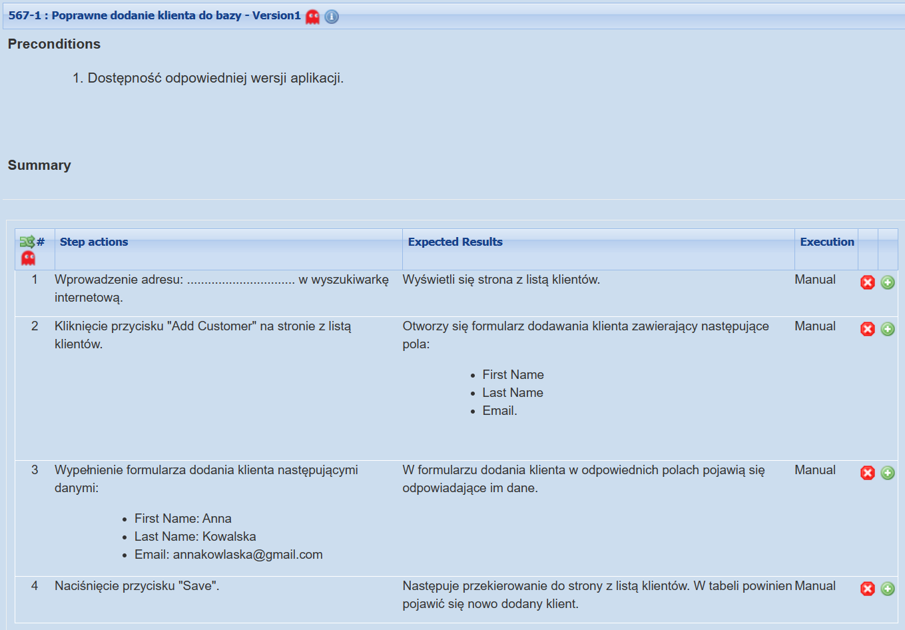
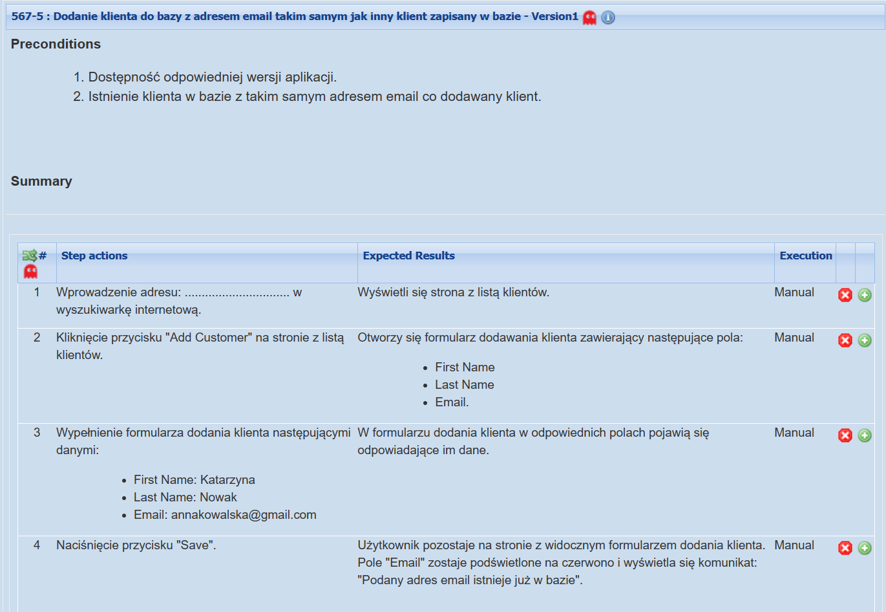
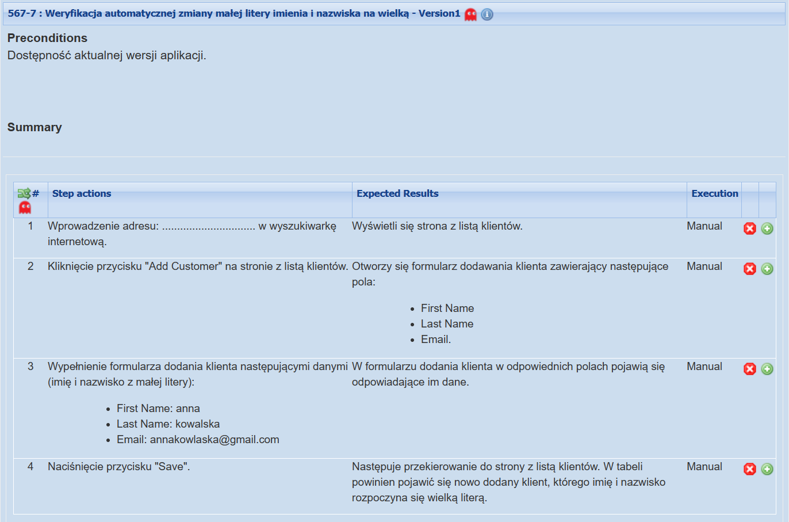
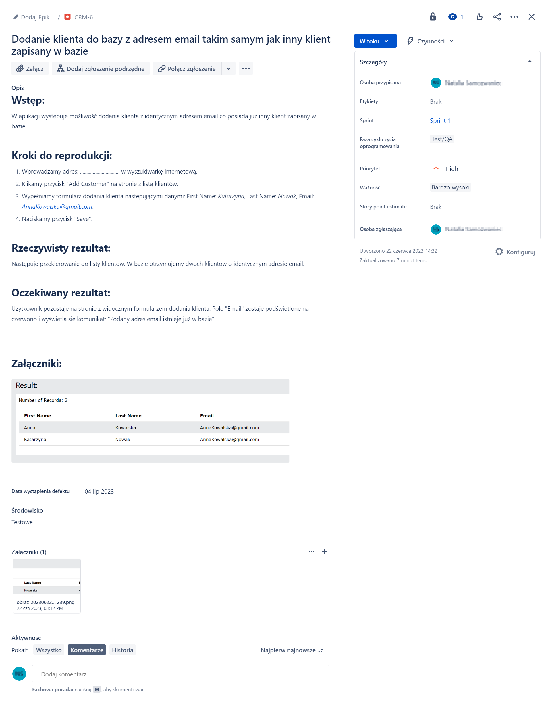

# Portfolio
## O mnie

Hej! Nazywam się Natalia Dąbek. Jestem inżynierem Politechniki Białostockiej kierunku zarządzanie i inżynieria produkcji. Po ukończeniu studiów zaczęłam interesować się testowaniem oprogramowania. Od tego momentu zdobywam wiedzę w zakresie testowania i chciałabym dalej się rozwijać w tym kierunku. Na tej stronie gromadzę swoje osobiste doświadczenia. 

## Poznane narzędzia

- TestLink
- Jira
- SoapUI
- BrowserStack
- Postman
- Git
- OWASP ZAP
- PicPick
- Sharex
- DevTools

## Umiejętności 

- SQL 
- SCRUM
- Tworzenie przypadków testowych
- Raportowanie błędów

## Wiedza teoretyczna

Wiedza teoretyczna na poziomie certyfikatu ISTQB poziom podstawowy. 

## Ukończone kursy

- [Praktyczny kurs testowania oprogramowania](https://www.udemy.com/course/praktyczny-kurs-testowania-oprogramowania/)
- [Podstawy manualnego testowania oprogramowania](https://www.udemy.com/course/kurs-testowania-oprogramowania/)

## Książki

- Sylabus ISTQB poziom podstawowy
- A. Roman, L. Stapp "Certyfikowany tester ISTQB poziom podstawowy"

## Moje przykładowe przypadki testowe

- 
- 
- 

## Mój przykładowy raport z wykonania planu testów

- [Raport z wykonania planu testów](./resources/raport.pdf)

## Moje przykładowe zgłoszenie defektu

- 

